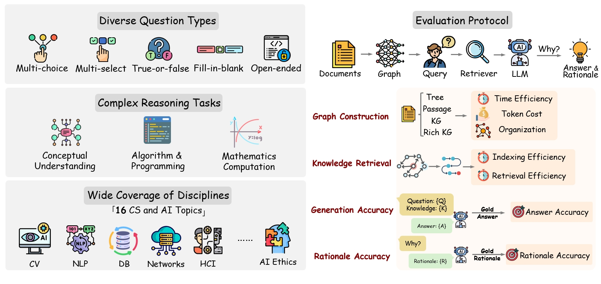

# GraphRAG-Bench
This is the official repo for GraphRAG-Bench: Challenging Domain-Specific Reasoning for Evaluating Graph Retrieval-Augmented Generation

<div align="left">
   <p>
   <a href='https://deep-polyu.github.io/RAG/'></a>
   <a href='https://arxiv.org/abs/2506.02404'></a>
   <a href=''></a>
  </p>
</div>

## 🎉 News
- **[2025-06-03]** We have released the paper [GraphRAG-Bench](https://arxiv.org/abs/2506.02404).
- **[2025-06-03]** We have released the dataset [GraphRAG-Bench](https://arxiv.org/abs/2506.02404).




## Dataset
The structure of the dataset is shown below:
### Question
```
Question/
├── FB.jsonl
├── MC.jsonl
├── MS.jsonl
├── OE.jsonl
├── TF.jsonl
```

```
Question example
{
"Question": "Why is it necessary for the server to use a special initial sequence number in the \n SYNACK?",
 "Level-1 Topic": "Computer networks", 
 "Level-2 Topic": "Network protocols and architectures", 
 "Rationale": "The server uses a special initial sequence number (ISN) in the SYN-ACK to ensure unique connection identification and proper packet sequencing. This also mitigates SYN flood attacks by making it harder for attackers to predict ISNs and hijack sessions.", 
 "Answer": "In order to defend itself against SYN FLOOD attack."
 }

```
### Corpus


