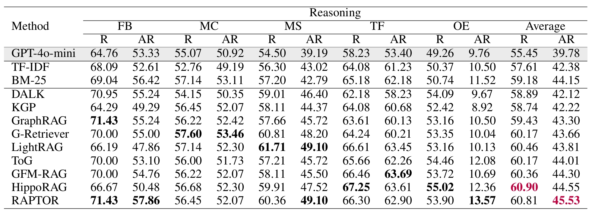
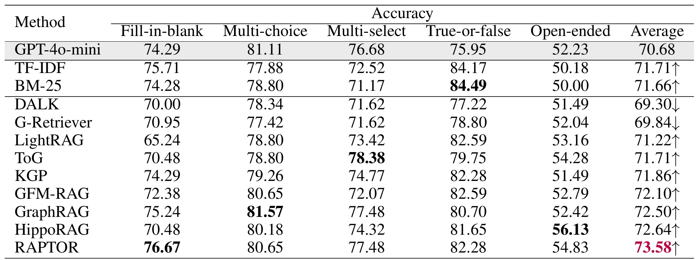

# GraphRAG-Bench
This is the official repo for GraphRAG-Bench: Challenging Domain-Specific Reasoning for Evaluating Graph Retrieval-Augmented Generation

<div align="left">
   <p>
   <a href='https://deep-polyu.github.io/RAG/'></a>
   <a href='https://arxiv.org/abs/2506.02404'></a>
   <a href='https://arxiv.org/abs/2506.02404'></a>
  </p>
</div>

## 🎉 News
- **[2025-06-03]** We have released the paper [GraphRAG-Bench](https://arxiv.org/abs/2506.02404).
- **[2025-06-03]** We have released the dataset [GraphRAG-Bench](https://arxiv.org/abs/2506.02404).


## Dataset
The structure of the dataset is shown below:
### Question
```
Question/
├── FB.jsonl   #Fill-in-blank
├── MC.jsonl   #Multi-choice
├── MS.jsonl   #Multi-select
├── OE.jsonl   #True-or-false
├── TF.jsonl   #Open-ended
```

```
Question example
{
"Question": "Why is it necessary for the server to use a special initial sequence number in the \n SYNACK?",
 "Level-1 Topic": "Computer networks", 
 "Level-2 Topic": "Network protocols and architectures", 
 "Rationale": "The server uses a special initial sequence number (ISN) in the SYN-ACK to ensure unique connection identification and proper packet sequencing. This also mitigates SYN flood attacks by making it harder for attackers to predict ISNs and hijack sessions.", 
 "Answer": "In order to defend itself against SYN FLOOD attack."
 }

```
### Corpus
We parsed out the images and content of the textbook. Users only need text content to use.md files, metadata to use.json files, and the presence of image supports multi-modal RAG methods.
```
Corpus/
├── Algorithms/   #Textbook name
│    ├── image
│    ├── Algorithms.md
│    └── Algorithms_content_list.json
│...
├── Database system concepts/...
└── Speech and Language Processing/...

```

## Evaluator
We provide the evaluator.py for evaluation.
Place your output files in the following structure:
```
data_name/
├── question/
│   ├── FB.jsonl
│   ├── MC.jsonl
│   ├── MS.jsonl
│   ├── OE.jsonl
│   └── TF.jsonl
├── output/
│   ├── GraphRAG-Bench_FB
│   ├── GraphRAG-Bench_MC
│   ├── GraphRAG-Bench_MS
│   ├── GraphRAG-Bench_OE
│   └── GraphRAG-Bench_TF
└── results_tmp.json (Generated after the code is run)
```

## Leaderboard
### Reasoning

### Accuracy

## Citation

If you find this repository helpful, please consider citing our paper:

```bibtex
@article{xiao2025graphrag,
  title={GraphRAG-Bench: Challenging Domain-Specific Reasoning for Evaluating Graph Retrieval-Augmented Generation},
  author={Xiao, Yilin and Dong, Junnan and Zhou, Chuang and Dong, Su and Zhang, Qianwen and Yin, Di and Sun, Xing and Huang, Xiao},
  journal={arXiv preprint arXiv:2506.02404},
  year={2025}
}
```

